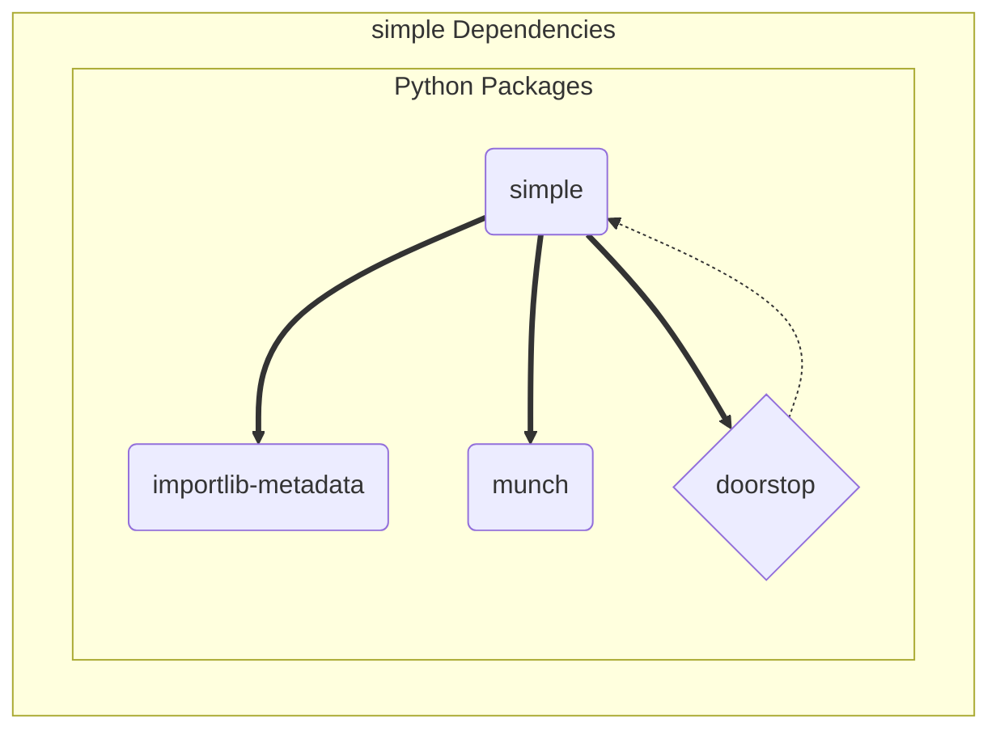

# Design Elements

The simple package provides a convenient example and baseline project
structure for demonstrating current packaging standards with dynamic
versioning using the core setuptools package and default PEP517 build
backend.

The primary install dependencies are importlib-metadata, doorstop, and
munch, where doorstop is primarily an offline dependency for managing
requirements data. Complete package dependencies are shown in the
figure below:

```{figure} assets/simple_dependency_graph.svg
:width: 90 %
:align: center
:alt: simple software units

Simple Software Units (captured from mermaid to SVG or PNG).
```

<details>
  <summary>simple_dependency_graph source</summary>
  simple dependency graph showing primary software units.


</details>

## Design decisions

More text here.
